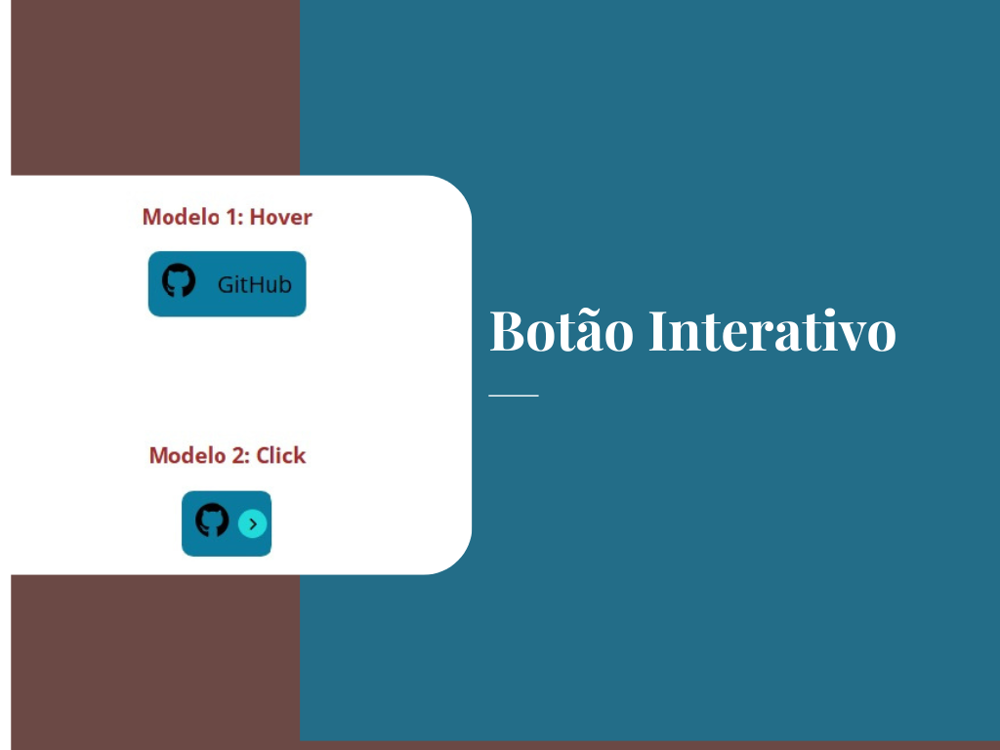

<h1 align="center"> Botão Interativo </h1>

Esse botão interativo doi realizado por mim, em HTML e CSS com transição ao passar o mouse ou também com botão click que realiza abertura e fechamento com texto GitHUb sumido e ficando somente a imagem da GitHub.

  <a href="#-tecnologias">Tecnologias</a>&nbsp;&nbsp;&nbsp;|&nbsp;&nbsp;&nbsp;
  <a href="#-Projeto">Projeto</a>&nbsp;&nbsp;&nbsp;|&nbsp;&nbsp;&nbsp;
  <a href="#-layout">Layout</a>&nbsp;&nbsp;&nbsp;

 

  

## 🚀 Tecnologias

Esse projeto foi desenvolvido com as seguintes tecnologias:

- HTML 
- CSS
- JavaScript
- Git e Github

## 💻 Projeto

Voce pode visualizar o projeto pronto projeto através [DESSE LINK](https://ricardotavaresdias.github.io/botao_interativo/)
O Projeto Botão Interativo é um agregador conhecimento Pessoal para avançar o conhecimento em HTML e CSS e JavaScript

## 🔖 Layout

O layout é simples e focado nos botãoes com obejetivo para conhecimento no html e css e javascript

---

